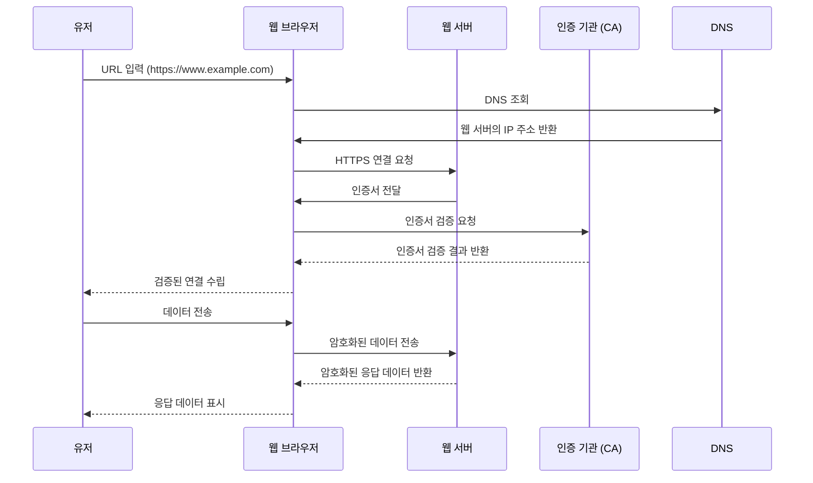

# CA (Certificate Authority)

해시태그: 네트워크, 인프라
상태: 작성 전
소유자: JaeJun
최종 편집 일시: July 27, 2024 11:06 PM

## 인증 기관 CA (Certificate Authority)

---

> 되짚어 보는 **CA 트랜잭션의 가치** : 중간 공격자(MITM)가 피싱사이트를 통해 화면은 비슷하게 속일 수 있을 지언정 브라우저에 표시되는 **URL까지 속이기**는 어렵습니다.
**SSL / TLS의 가치** : 비대칭 키를 통해 데이터를 암호화 / 복호화 시킵니다.
따라서 **스니핑 예방**에 의미가 있지만 엔드포인트 공격엔 다소 취약합니다.
> 

### 🚨혼동 방지

- 공개키 방식으로 **데이터를 암호화** 할 때는 공개키로 암호화, 개인키로 복호화가 이루어집니다.
- 공개키 방식으로 **전자서명**을 할 때는 개인키로 서명, 공개키로 서명검증을 진행합니다.