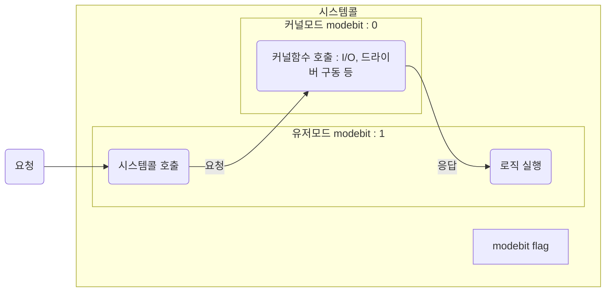

# 시스템 콜과 인터럽트

목차

- [시스템 콜과 인터럽트](#시스템-콜과-인터럽트)
  - [시스템 콜](#시스템-콜)
    - [소개](#소개)
    - [역할](#역할)
    - [동작 방식](#동작-방식)
    - [사용목적](#사용목적)

## 시스템 콜

### 소개

- 운영체제의 커널에 서비스를 요청하는 인터페이스입니다.

### 역할

- 커널 함수의 추상화 계층을 제공합니다.
- 유저프로그램의 컴퓨터자원에 대한 직접접근을 차단합니다.

### 동작 방식

- 시스템콜이 작동될 때 modebit를 통해 유저모드와 커널모드를 구분합니다.

### 사용목적

커널 함수에 대한 추상화 계층을 제공하면 얻을 수 있는 이점은 무엇이 있을까요?

- 컴퓨터 자원에 대한 직접 호출을 막아서 유저가 이상한 방식으로 사용하는 것을 1차적으로 막을 수 있습니다.
- 커널 함수에 대한 의존성이 없어지기 때문에 커널 사양이 바뀌더라도 프로그램이 바뀔 필요가 없어집니다.
- 대표적인 시스템콜 함수는 `open`, `read`, `fork`, `malloc` 등이 있습니다.
- 추상화단계가 높아질 수록 사용이 쉬워집니다.

<!-- metadata / etc -->

