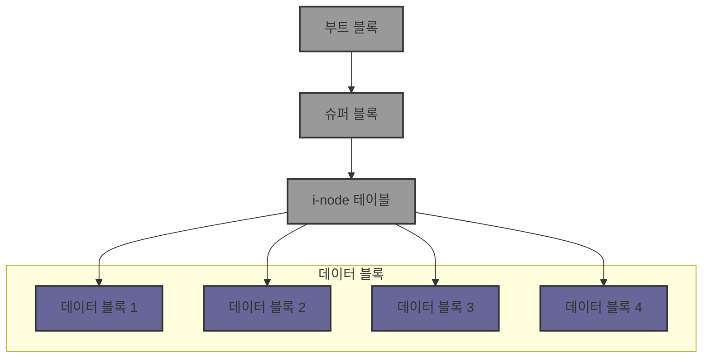

# 유닉스 디스크 블록의 구조에 대해 알아보자 (level2)

> 보면 좋지만, `VFS`가 존재하기에 자세하게 알지 못해도 크게 문제 없는 내용!

> VFS는 여러가지 파일 시스템의 추상화된 인터페이스를 제공해줘서 사용자가 파일 시스템을 잘 모르더라도 쉽게 사용할 수 있게 해준다.

유닉스 운영체제는 그 특유의 안정성과 효율성 덕분에 다양한 분야에서 오랫동안 사용되어 왔다. 
유닉스의 파일 시스템의 구조는 디스크 블록이다. 

## 디스크 블록이란?

디스크 블록은 디스크 드라이브에서 데이터를 저장하는 가장 작은 단위다. 
따라서 데이터를 읽고 쓰기 위해 디스크는 이 블록 단위로 접근한다. 

## 블록 구조

유닉스 파일 시스템에서 디스크 블록은 여러 가지 정보와 데이터를 담고 있다. 
크게 보면, 유닉스 파일 시스템의 디스크 블록은 다음과 같은 세 부분으로 구성된다 

1. **부트 블록**: 디스크의 첫 번째 블록으로, 시스템을 부팅할 때 필요한 정보를 담고 있다. 
   이 블록에는 부트스트랩 코드라고 불리는 프로그램이 포함되어 있으며, 시스템이 부팅될 때 이 코드를 실행하여 운영체제를 로드한다. 
   부트 블록은 일반적인 데이터 저장에는 사용되지 않는다. 

2. **슈퍼블록**: 파일 시스템의 중요한 메타데이터가 저장된 블록이다. 
   슈퍼블록에는 파일 시스템의 전체 크기, 사용 가능한 블록 수, i-node(파일 시스템 내의 모든 파일을 식별하는 고유 번호) 정보, 디스크 블록 크기 등 파일 시스템을 관리하는 데 필요한 정보들이 포함되어 있다. 
   파일 시스템이 마운트될 때, 운영체제는 이 슈퍼블록을 참조하여 파일 시스템의 상태를 파악하고 필요한 조치를 취한다. 

3. **데이터 블록**: 실제 파일 데이터가 저장되는 블록이다. 
   파일 시스템의 대부분의 블록이 이 데이터 블록에 할당되며, 파일이나 디렉터리의 내용이 이곳에 저장된다. 
   데이터 블록은 파일을 저장할 때 연속적으로 할당될 수도 있고, 비연속적으로 할당될 수도 있다. 
   연속적인 할당은 성능이 좋지만, 비연속적인 할당은 디스크 조각화 현상을 일으킬 수 있다. 

### 아이노드(I-node)와 디스크 블록간의 관계

유닉스 파일 시스템에서 <mark>아이노드(i-node)는 파일에 대한 모든 정보를 담고 있는 구조체</mark>다. 
각 파일이나 디렉터리는 고유한 inode를 가지며, 이 inode는 파일의 크기, 소유자 정보, 권한, 그리고 파일이 저장된 디스크 블록의 위치를 포함하고 있다. 

인오드는 실제 데이터를 저장하지 않지만, 해당 파일이 어떤 데이터 블록에 저장되어 있는지에 대한 주소(포인터)를 가지고 있다. 
예를 들어, 하나의 큰 파일이 여러 디스크 블록에 걸쳐 저장되어 있다면, 이 블록들의 위치를 아이노드가 가리키게 된다. 

## 마무리

이번 포스팅에서는 유닉스 디스크 블록의 구조에 대해 살펴보았다. 

[학습내용]
- 유닉스 파일 시스템은 디스크 블록을 통해 데이터를 저장하고 관리한다.
- 각 디스크 블록은 부트 블록, 슈퍼블록, 데이터 블록, 아이노드를 가지고 있다.
- 각 부분들의 역할

읽어줘서 고마워! 😊
