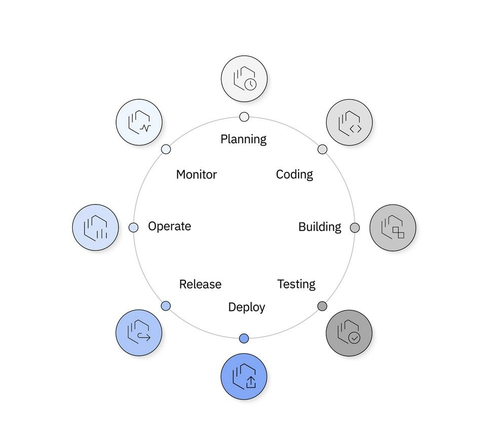

# DevOps

DevOps는 소프트웨어 개발 및 IT 운영 팀의 작업을 결합하고 자동화하여 고품질 애플리케이션 및 서비스 제공을 가속화하는 <mark>소프트웨어 개발 방법론</mark>입니다. -ibm-

## DevOps의 등장 배경

- 기존에는 IT개발팀, 운영팀이 분리되어 운영되어왔으나 2000년대 초에 애자일 방법론이 등장하고 이후 DevOps가 등장하면서 개발팀과 운영팀이 협업하게 되었습니다.

- DevOps 방법의 핵심은 지속적 통합 및 지속적 배포(CI/CD)입니다.

- 애자일 개발방식을 통해 시스템 프로비저닝, 구성, 승인 테스트, 관리 및 모니터링에서 소프트웨어 제공 라이프사이클에 병목 현상을 초래할 수 있는 요인이 더 명확하게 드러났습니다.

- 초기에 애자일 방법론이 개발팀의 속도를 높이는데 중점을 두었다면 DevOps는 개발팀과 운영팀의 협업을 강조합니다.

## DevOps 핵심가치

- **협업**: 개발팀과 운영팀 간의 원활한 커뮤니케이션과 협력을 통해 장애를 줄이고 개발 속도를 높입니다.
- **자동화**: 빌드, 테스트, 배포 등의 반복적인 과정을 자동화하여 효율성을 높이고 오류를 최소화합니다.
- **CI/CD**: 지속적인 통합과 지속적인 배포를 통해 코드 변경 사항을 빠르고 안정적으로 배포합니다.
-	**모니터링**: 시스템의 성능과 상태를 실시간으로 모니터링하여 문제를 신속하게 감지하고 대응합니다.
- **피드백**: 사용자와 시스템으로부터의 피드백을 적극적으로 반영하여 지속적으로 개선합니다.

## DevOps 라이프사이클

DevOps 라이프사이클은 다음과 같은 단계로 구성됩니다.

1. 계획
2. 개발
3. 코드 빌드
4. 테스트
5. 배포
6. 릴리즈
7. 운영
8. 모니터링

## DevOps의 장점

- 더 원활한 협업
- 더 빠른 서비스 제공
- 신뢰성 향상
- 더 신속한 확장
- 업무 만족도 향상

## DevOps 도구

### 프로젝트 관리 도구

스크럼, 린, 칸반, 워터폴, 애자일등의 프로젝트 관리 방법론을 지원하는 도구입니다.

- Jira
- Github Issue

### 협업 소스 코드 리포지토리

- Github
- Gitlab

### CI/CD 파이프라인

- Jenkins
- Github Actions
- Gitlab CI
- Travis CI
- Circle CI

### 테스트 자동화 프레임워크

- Selenium
- Appium
- Katalon
- Robot Framework
- Serenity

### 구성 관리 도구

- Ansible
- Terraform
- Chef
- Puppet
- Kubernetes

### 모니터링 도구

- Datadog
- Nagios
- Prometheus
- Splunk

### 피드백 도구

- HotJar
- Google Analytics
- Mixpanel

## 주요 특징

- 클라우드 네이티브 환경과 상호작용
  - 마이크로 서비스화
  - 컨테이너에 배포
  - 쿠버네티스를 사용하여 운영
